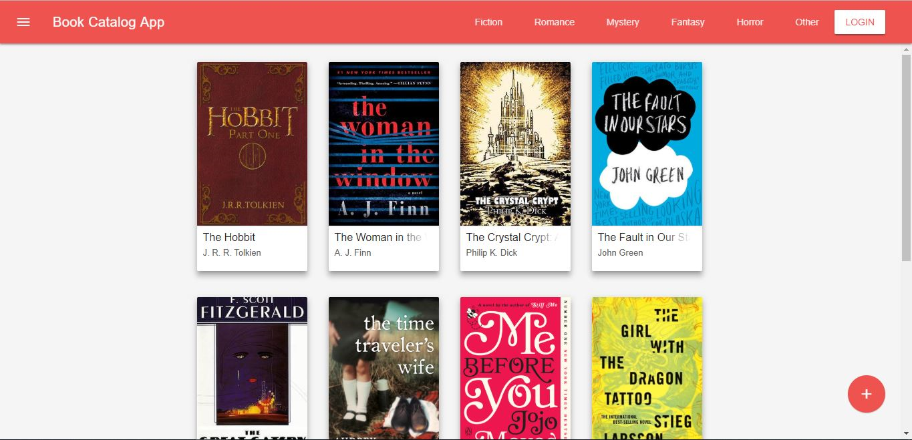
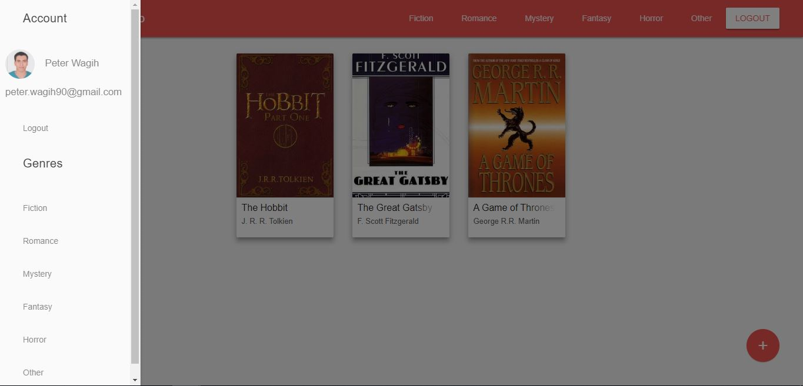
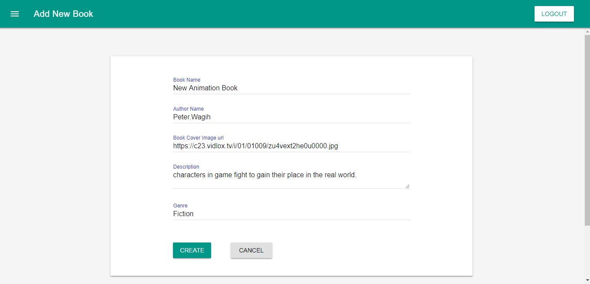
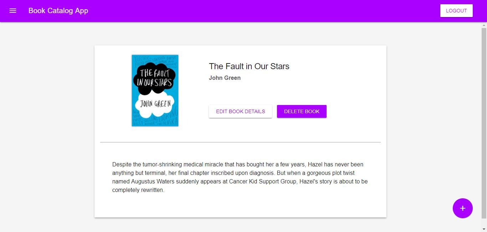

# BookCatalogApp

### Project Overview
To Develop an application that provides a list of items within a variety of categories as well as provide a user registration and authentication system. Registered users will have the ability to post, edit and delete their own items.

### Why This Project?
Modern web applications perform a variety of functions and provide amazing features and utilities to their users; but deep down, it’s really all just creating, reading, updating and deleting data. In this project, you’ll combine your knowledge of building dynamic websites with persistent data storage to create a web application that provides a compelling service to your users.

### What Will I Learn?
  * Develop a RESTful web application using the Python framework Flask
  * Implementing third-party OAuth authentication.
  * Implementing CRUD (create, read, update and delete) operations.

## About Item Catalog Web App
This web app is a project for the Udacity [FSND Course](https://www.udacity.com/course/full-stack-web-developer-nanodegree--nd004).

The project is a RESTful web application utilizing the Flask framework which accesses a SQL database that populates Books under some categories. 
OAuth2 provides authentication for further CRUD functionality on the application. Currently OAuth2 is implemented for Google Accounts.

## In This Repo
This project has one main Python module `main.py` which runs the Flask application. A SQL database is created using the `database_setup.py` module and you can populate the database with test data including `Admin` User who created them using `lotsofbookstoadd.py`.

The Flask application uses stored HTML templates in the templates folder to build the front-end of the application. CSS/JS/Images are stored in the static directory.

## Skills Required
1. Python
2. HTML
3. CSS
4. OAuth
5. Flask Framework

## Installation
There are some dependencies and a few instructions on how to run the application.
Separate instructions are provided to get GConnect working also.

## Dependencies
- [Vagrant](https://www.vagrantup.com/)
- [Udacity Vagrantfile](https://github.com/udacity/fullstack-nanodegree-vm)
- [VirtualBox](https://www.virtualbox.org/wiki/Downloads)

## How to Install
1. Install Vagrant & VirtualBox
2. Clone Or Download [fullstack-nanodegree-vm](https://github.com/udacity/fullstack-nanodegree-vm) repository
3. Go to Vagrant directory and either clone this repo or download and place zip here
3. Launch the Vagrant VM (`vagrant up`)
4. Log into Vagrant VM (`vagrant ssh`)
5. Navigate to `cd/vagrant` as instructed in terminal
6. The main.py imports requests which is not on this vm. Run sudo pip install requests
7. Setup application database `python /catalog/database_setup.py`
8. *Insert fake data `python /catalog/lotsofbookstoadd.py`
9. Run application using `python /catalog/main.py`
10. Access the application locally using http://localhost:5000

*Optional step(s)

## Using Google Login
To get the Google login working there are a few additional steps:

1. Go to [Google Dev Console](https://console.developers.google.com)
2. Sign up or Login if prompted
3. Go to Credentials
4. Select Create Credentials > OAuth Client ID
5. Select Web application
6. Enter name 'Book Catalog App'
7. Authorized JavaScript origins = 'http://localhost:5000'
8. Authorized redirect URIs = 'http://localhost:5000/login' && 'http://localhost:5000/gconnect'
9. Select Create
10. Copy the Client ID and paste it into the `google-signin-client_id` in base.html and app.js file (for Google sign in)
11. On the Dev Console Select Download JSON
12. Rename JSON file to client_secret.json
13. Place JSON file in catalog directory that you cloned from [fullstack-nanodegree-vm](https://github.com/udacity/fullstack-nanodegree-vm) repository
14. Run application using `python /catalog/main.py`

## JSON Endpoints
The following are open to the public:

Book Catalog JSON: `/books.json/`
    - Displays the whole catalog with all books including creator name and email

Book Catalog By Category: `/booksByCategories.json/`
    - Displays all available books under each category
	
Books for single Category: `/books/category/<int:category_id>.json/`
    - Displays all books under specific category

Book By Category: `/books/category/<int:category_id>/<int:bookId>.json/`
    - Display Book Information using category_id and book id

Categories : `/catalog/categories.json/`
    - Displays Categories 

### Screenshots:

